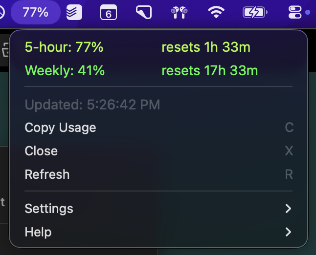
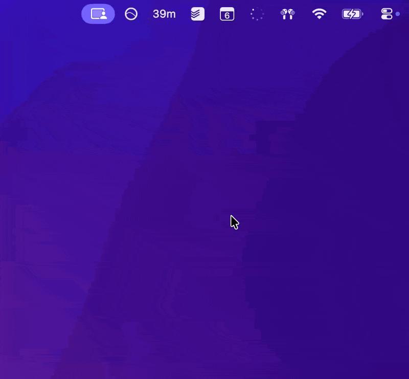

# Claude Usage Tracker (Swift)

A lightweight native macOS menu bar app that displays your Claude usage limits and reset times.


## Features

| Feature | Description |
| ------- | ----------- |
| **Live usage in menu bar** | See your 5-hour session percentage and weekly usage at a glance. |
| **Desktop cookies or OAuth** | Choose how to fetch data in Settings — Desktop cookies (recommended) avoid OAuth rate limits; OAuth is the classic option. |
| **Global hotkey** | Press `Cmd+Shift+X` from anywhere to open the menu (customizable in Settings). |
| **In-menu shortcuts** | With the menu open: `c` copy usage, `r` refresh, `g` usage graph, `x` close. |
| **Color-coded severity** | Optional projection-based green → yellow → orange → red that answers "will I run out before the window resets?" |
| **Rate Insight** | Optional per-category usage rate (%/hr or %/day) with descriptors: *light*, *steady*, *fast*, *heavy*, *extreme*. |
| **Usage Graph** | GitHub-contribution-style 90-day heatmap of your daily peak usage, rendered in a floating panel. Press `g` to open. |
| **5-hour & weekly limits** | Utilization plus countdown to reset for each window. |
| **Auto-refresh** | Poll every 1, 5, 30, or 60 minutes. |
| **Open at Login** | Start the app when you log in to your Mac. |
| **Persistent history** | Usage data stored in `~/Library/Application Support/ClaudeUsage/` — survives app updates and reinstalls. |
| **Export Data** | Download your full usage history as JSON for custom analysis (Settings → Export Data). |
| **Debug Mode** | Copy the latest request or response as JSON, or a ready-to-run `curl` (Settings → Debug Mode). |
| **Native Swift** | No Python, no runtime deps — single app, ~50 MB RAM. |

## Screenshot



### Demos

**Keyboard Shortcuts** — use `Cmd+Shift+X` to open the menu, then `c` to copy, `r` to refresh, and `x` to close. (Default was changed from `Cmd+Shift+C` to avoid conflicting with iTerm2's copy mode and to pair open/close: **X** opens the menu, **x** closes it.)


**Mouse Navigation** - click the menu bar item to navigate with your mouse:


**100% limit** - when your session usage reaches 100%, the menu shows reset time and optional alerts:



## Requirements

- macOS 13.0+
- [Claude Code](https://claude.ai/code) installed and logged in (for OAuth usage), **or** [Claude Desktop](https://claude.ai/download) installed and logged in to claude.ai (for Desktop cookie–based usage)
- Claude Pro or Max subscription

## Installation

### Build from Source

```bash
git clone https://github.com/asboyer/claude-usage-swift.git
cd claude-usage-swift
./build.sh
open ClaudeUsage.app
```

To keep the app in your Applications folder (optional):

```bash
cp -r ClaudeUsage.app /Applications/
open /Applications/ClaudeUsage.app
```

## Updating

### From a cloned repo (recommended)

If you cloned this repo (e.g. into `~/Developer/claude-usage-swift`), you can update to the latest version with:

```bash
cd /path/to/claude-usage-swift
git pull
./build.sh
cp -r ClaudeUsage.app /Applications/
open /Applications/ClaudeUsage.app
```

This rebuilds and reinstalls the app into `/Applications`, then opens the new version.

### Using the update script (shortcut)

For quicker local updates during development, you can use the included `update.sh` script from the repo root:

```bash
./update.sh
```

This script:

- Quits any running `ClaudeUsage` process
- Removes `/Applications/ClaudeUsage.app`
- Runs `./build.sh`
- Moves the new `ClaudeUsage.app` into `/Applications/`
- Opens `/Applications/ClaudeUsage.app`

### From the app

In the menu bar app, go to **Help → Update…** to open this **Updating** section on GitHub in your browser.

## How It Works

The app can fetch usage in two ways (choose in **Settings → Usage Source**):

### Option 1: Desktop cookies (recommended)

Uses the same approach as [claude-web-usage](https://github.com/skibidiskib/claude-web-usage): Claude Desktop's web session cookies and a separate API so you avoid the OAuth usage API rate limits.

1. Reads the encryption key from Keychain (`Claude Safe Storage`)
2. Decrypts Claude Desktop's Chromium cookies from `~/Library/Application Support/Claude/Cookies` (PBKDF2 + AES-128-CBC)
3. Calls `https://claude.ai/api/organizations/{orgId}/usage` with `sessionKey` and `lastActiveOrg`
4. If that fails (e.g. no Claude Desktop), falls back to the OAuth usage API

**Requires**: Claude Desktop app installed and logged in to claude.ai at least once (cookies can be read even when the app isn't running).

### Option 2: OAuth API

1. Reads token from Keychain (`Claude Code-credentials`)
2. Calls `api.anthropic.com/api/oauth/usage`
3. Displays utilization and reset times

**Rate limit handling**: If the OAuth usage API returns 429, the menu shows a red "Rate limited. Try again later." line above "Updated." You can switch to Desktop cookies in Settings to use a separate rate-limit bucket.

**Requires**: Claude Code installed and logged in.

The usage APIs are metadata-only — no inference tokens are consumed.

## Settings

All settings are accessible from the **Settings** submenu:

- **Refresh Interval** — 1 minute, 5 minutes, 30 minutes, or 1 hour
- **Usage Source** — how to fetch usage:
  - **Use Desktop Cookies (recommended)** — Claude Desktop web session; avoids OAuth usage API rate limits; falls back to OAuth if cookies aren't available
  - **Use OAuth API** — only `api.anthropic.com/api/oauth/usage` (may hit 429 when rate limited)
- **Colors** — toggle projection-based color coding:
  - **Green** (projected ≤80%) — on pace to finish well under 100%
  - **Yellow** (projected 80–105%) — might reach 100%
  - **Orange** (projected 105–140%) — will overshoot, burning fast
  - **Red** (projected >140% or already at 100%) — significantly overshooting
- **Rate Insight** — toggle per-category rate display showing %/hr (5-hour categories) or %/day (weekly categories) with a descriptor (*light*, *steady*, *fast*, *heavy*, *extreme*) based on sustainable usage thresholds
- **Keyboard Shortcut** — global hotkey to open the menu (default: `Cmd+Shift+X`)
- **Open at Login** — start the app at login
- **Notifications** — 100% alerts, usage limit alerts, reset alarms, and sounds
- **More** — pin or unpin categories (5-hour, Weekly, Opus, Sonnet, OAuth Apps, Cowork, Extra)
- **Debug Mode** — copy the latest request or response as formatted JSON, or copy a `curl` command that uses `CC_TOKEN` from Keychain (handy for reproducing calls in the terminal)
- **Export Data** — save your full usage history (rolling samples + daily peak summaries) as a JSON file for custom analysis

## Data Storage

Usage history is stored persistently at:

```text
~/Library/Application Support/ClaudeUsage/usage_history.json
```

This location is outside the app bundle, so your data survives app updates, deletions, and reinstalls. The file contains:

- **Rolling samples** — recent utilization readings per category (used for rate calculations)
- **Daily summaries** — one peak-utilization entry per day per category (used for the usage graph and long-term tracking)

On first launch, any existing usage data from the app's previous UserDefaults storage is automatically migrated to this file.

## Troubleshooting

### Menu bar shows "..." or no data

- **Desktop cookies (default)**: Ensure [Claude Desktop](https://claude.ai/download) is installed and you've logged in to claude.ai at least once so cookies exist. The app does not need to be running.
- **OAuth API**: Ensure [Claude Code](https://claude.ai/code) is installed and logged in; run `claude` in terminal to confirm.
- Try **Settings → Usage Source → Use Desktop Cookies (recommended)** if you're getting persistent "Rate limited" with OAuth.

### "Rate limited. Try again later." in red

The OAuth usage API (`api.anthropic.com/api/oauth/usage`) is returning 429. Switch to **Settings → Usage Source → Use Desktop Cookies (recommended)** so the app uses Claude Desktop's web session and a different rate limit bucket.

### Keychain access prompt

The app may ask for access to Keychain items **Claude Code-credentials** (OAuth) and/or **Claude Safe Storage** (Claude Desktop cookies). Choose **Allow** or **Always Allow** so it can read usage. Access is attributed to **ClaudeUsage** (the app), not the `security` CLI. To revoke later: Keychain Access → find the item → Access Control → remove ClaudeUsage.

### Usage shows 0% or doesn't update

- **Desktop cookies**: Open Claude Desktop and log in to claude.ai so cookies are present (and not expired).
- **OAuth**: Run `claude` in terminal; if your token expired, run `claude setup-token` and restart the app.
- **API key users**: This app tracks subscription usage; it requires Pro or Max and does not use API credits.

### OAuth token has expired (OAuth mode only)

1. Delete old credentials: `security delete-generic-password -s "Claude Code-credentials"`
2. Run `claude setup-token` to get a fresh token
3. Restart the app

### App won't open (macOS security)

- Go to **System Settings → Privacy & Security**
- Find "ClaudeUsage was blocked" and click **Open Anyway**

### Building fails

- Ensure Xcode Command Line Tools: `xcode-select --install`

## Development

### Run tests

```bash
swift test --parallel
```

### Lint and format

This project uses Swift Format plus `.editorconfig` settings with **4-space indentation**.

```bash
./scripts/lint.sh
./scripts/format.sh
```

## Contributing

Contributions are welcome. Before opening a pull request:

1. Read and follow [`docs/CODING_PRACTICES.md`](docs/CODING_PRACTICES.md).
2. Run tests (`swift test --parallel`).
3. Run lint/format checks (`./scripts/lint.sh` and `./scripts/format.sh`).
4. Keep commits focused and use conventional commit messages.

## Credits

Current maintainer/author of this Swift app fork: **asboyer**.

This project is a fork of [claude-usage-swift](https://github.com/cfranci/claude-usage-swift) by [cfranci](https://github.com/cfranci). The original Python version is available at [claude-usage-tracker](https://github.com/cfranci/claude-usage-tracker) by [cfranci](https://github.com/cfranci).

The **Desktop cookie–based usage** flow (and Keychain/cookie decryption approach) is inspired by [claude-web-usage](https://github.com/skibidiskib/claude-web-usage), which documents using Claude Desktop's web session to avoid OAuth usage API rate limits.

## License

MIT
