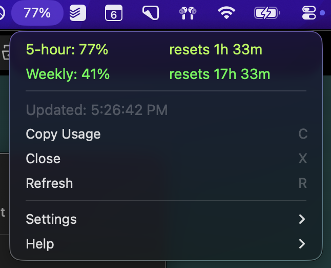
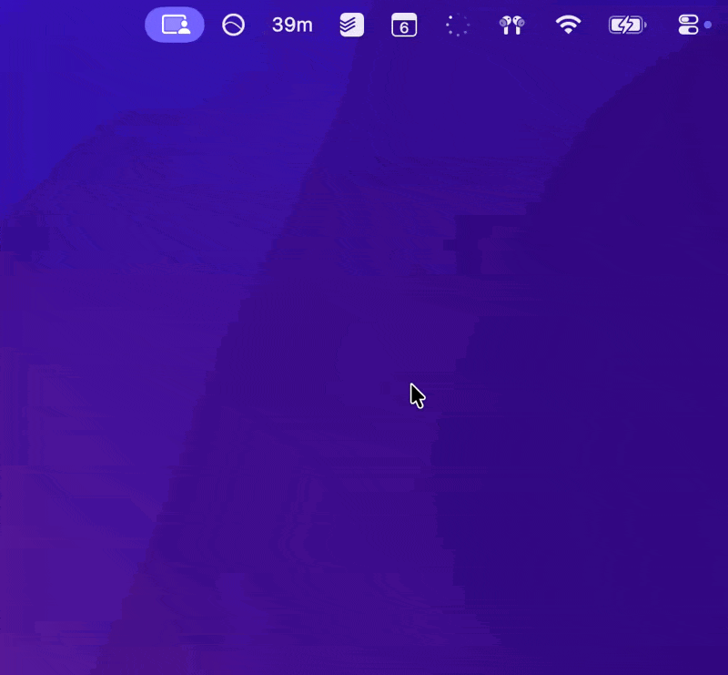

# Claude Usage Tracker (Swift)

A lightweight native macOS menu bar app that displays your Claude, OpenAI Codex, Cursor, and opencode usage limits and reset times.


## Features

| Feature | Description |
| ------- | ----------- |
| **Live usage in menu bar** | See your 5-hour session percentage and weekly usage at a glance. |
| **Codex usage** | Tracks your Codex 5-hour and weekly limits alongside Claude, listed under its own heading in the dropdown. |
| **Cursor usage** | Tracks the two included-usage buckets on your Cursor plan — Cursor Models and Other Models — under its own heading. |
| **Opencode spend** | Shows month-to-date dollars per model, read from opencode's own session database. No API key, no network call. |
| **Follows what you just used** | The menu bar shows the percentage for whichever provider's usage increased most recently. |
| **Surfaces overage spend** | When extra usage credits tick up, the menu bar shows dollars spent instead of a percentage. |
| **Desktop cookies or OAuth** | Choose how to fetch data in Settings — Desktop cookies (recommended) avoid OAuth rate limits; OAuth is the classic option. |
| **Global hotkey** | Press `Cmd+Shift+X` from anywhere to open the menu (customizable in Settings). |
| **In-menu shortcuts** | With the menu open: `c` copy usage, `r` refresh, `g` usage graph, `x` close. |
| **Color-coded severity** | Optional projection-based green → yellow → orange → red that answers "will I run out before the window resets?" |
| **Rate Insight** | Optional per-category usage rate (%/hr or %/day) with descriptors: *light*, *steady*, *fast*, *heavy*, *extreme*. |
| **Usage Graph** | GitHub-contribution-style 90-day heatmap of your daily peak usage, rendered in a floating panel. Press `g` to open. |
| **5-hour & weekly limits** | Utilization plus countdown to reset for each window. |
| **Per-model weekly limit** | Shows the weekly limit scoped to the model you're using (e.g. Fable), labeled with the name the API reports. |
| **Auto-refresh** | Poll every 1, 5, 30, or 60 minutes. |
| **Open at Login** | Start the app when you log in to your Mac. |
| **Persistent history** | Usage data stored in `~/Library/Application Support/ClaudeUsage/` — survives app updates and reinstalls. |
| **Export Data** | Download your full usage history as JSON for custom analysis (Settings → Export Data). |
| **Debug Mode** | Copy the latest request or response as JSON, or a ready-to-run `curl` (Settings → Debug Mode). |
| **Native Swift** | No Python, no runtime deps — single app, ~50 MB RAM. |

## Screenshot



### Demos

**Keyboard Shortcuts** — use `Cmd+Shift+X` to open the menu, then `c` to copy, `r` to refresh, and `x` to close. (Default was changed from `Cmd+Shift+C` to avoid conflicting with iTerm2's copy mode and to pair open/close: **X** opens the menu, **x** closes it.)


**Mouse Navigation** - click the menu bar item to navigate with your mouse:


**100% limit** - when your session usage reaches 100%, the menu shows reset time and optional alerts:



## Requirements

- macOS 13.0+
- [Claude Code](https://claude.ai/code) installed and logged in (for OAuth usage), **or** [Claude Desktop](https://claude.ai/download) installed and logged in to claude.ai (for Desktop cookie–based usage)
- Claude Pro or Max subscription

## Installation

### Build from Source

```bash
git clone https://github.com/asboyer/claude-usage-swift.git
cd claude-usage-swift
./build.sh
open ClaudeUsage.app
```

To keep the app in your Applications folder (optional):

```bash
cp -r ClaudeUsage.app /Applications/
open /Applications/ClaudeUsage.app
```

## Updating

### From a cloned repo (recommended)

If you cloned this repo (e.g. into `~/Developer/claude-usage-swift`), you can update to the latest version with:

```bash
cd /path/to/claude-usage-swift
git pull
./build.sh
cp -r ClaudeUsage.app /Applications/
open /Applications/ClaudeUsage.app
```

This rebuilds and reinstalls the app into `/Applications`, then opens the new version.

### Using the update script (shortcut)

For quicker local updates during development, you can use the included `update.sh` script from the repo root:

```bash
./update.sh
```

This script:

- Quits any running `ClaudeUsage` process
- Removes `/Applications/ClaudeUsage.app`
- Runs `./build.sh`
- Moves the new `ClaudeUsage.app` into `/Applications/`
- Opens `/Applications/ClaudeUsage.app`

### From the app

In the menu bar app, go to **Help → Update…** to open this **Updating** section on GitHub in your browser.

## How It Works

The app can fetch usage in two ways (choose in **Settings → Usage Source**):

### Option 1: Desktop cookies (recommended)

Uses the same approach as [claude-web-usage](https://github.com/skibidiskib/claude-web-usage): Claude Desktop's web session cookies and a separate API so you avoid the OAuth usage API rate limits.

1. Reads the encryption key from Keychain (`Claude Safe Storage`)
2. Decrypts Claude Desktop's Chromium cookies from `~/Library/Application Support/Claude/Cookies` (PBKDF2 + AES-128-CBC)
3. Calls `https://claude.ai/api/organizations/{orgId}/usage` with `sessionKey` and `lastActiveOrg`
4. If that fails (e.g. no Claude Desktop), falls back to the OAuth usage API

**Requires**: Claude Desktop app installed and logged in to claude.ai at least once (cookies can be read even when the app isn't running).

### Option 2: OAuth API

1. Reads token from Keychain (`Claude Code-credentials`)
2. Calls `api.anthropic.com/api/oauth/usage`
3. Displays utilization and reset times

**Rate limit handling**: If the OAuth usage API returns 429, the menu shows a red "Rate limited. Try again later." line above "Updated." You can switch to Desktop cookies in Settings to use a separate rate-limit bucket.

**Requires**: Claude Code installed and logged in.

The usage APIs are metadata-only — no inference tokens are consumed.

### Codex usage

Codex is fetched independently of Claude on the same refresh cycle, and exposes a 5-hour and a weekly limit window:

1. Reads the OAuth access token from `~/.codex/auth.json` (or `$CODEX_HOME/auth.json`)
2. Calls `https://chatgpt.com/backend-api/wham/usage` with `Authorization: Bearer <token>`
3. Selects the five-hour and seven-day windows from the response — plans report them as either the primary or secondary window, so each is matched by window length rather than position. The 5-hour row is hidden on plans that report no session window.
4. If the token is missing or rejected (for example, expired), falls back to the most recent `rate_limits` payload Codex CLI wrote into `~/.codex/sessions/`

The fallback data is only as fresh as your last Codex run, so re-running `codex` refreshes both the token and the local data.

**Requires**: Codex CLI installed and logged in. If neither the token nor local sessions are available, the Codex section is hidden and the app behaves exactly as before.

> The Codex usage endpoint is an internal, undocumented ChatGPT API. It is not covered by any stability guarantee and its shape may change.

### Cursor usage

Cursor is fetched independently on the same refresh cycle. Unlike Claude and Codex it has no
rolling window: usage is a dollar budget that resets on your billing cycle, split across two
buckets that are metered separately.

1. Reads the access token the Cursor CLI stores in the login keychain (`cursor-access-token` / `cursor-user`)
2. Calls `https://api2.cursor.sh/aiserver.v1.DashboardService/GetCurrentPeriodUsage`
3. Shows `autoPercentUsed` as **Cursor Models** (Composer, Cursor Grok) and `apiPercentUsed` as **Other Models**, both resetting at the end of the billing cycle

The two buckets have different limits, so their percentages are not comparable to each other —
they are the same two bars Cursor shows under Plan & Usage, rounded up the same way. The menu bar
tracks whichever bucket is closest to running out.

The token is read by running `/usr/bin/security`, the same binary the Cursor CLI uses to store it.
Reading it any other way would prompt for keychain access on every launch.

**Requires**: Cursor CLI installed and logged in (`cursor-agent login`). Cursor writes no usage
snapshot to disk, so there is no offline fallback — if the token is missing or rejected, the Cursor
section is hidden and the app behaves exactly as before.

> The Cursor usage endpoint is an internal, undocumented API used by the Cursor client. It is not
> covered by any stability guarantee and its shape may change. Cursor's documented Admin and
> Analytics APIs report team-wide activity, not your own included-usage percentages.

### Opencode spend

Opencode is the one provider that reports **dollars, not a percentage of a limit** — you pay per
token, so there is no limit to be a percentage of. It is also the only one read entirely offline.

1. Opens `~/.local/share/opencode/opencode.db` read-only (opencode's own SQLite session store)
2. Sums `cost` over every completed assistant turn since the 1st of the current month
3. Lists each model's month-to-date spend, most expensive first

The section shows the three priciest models, with **More** revealing every model that cost
anything (and **Less** collapsing it again). Models that cost nothing are never listed: a
subscription-billed provider such as a ChatGPT plan reports `cost: 0` on every turn, and thousands
of free turns would otherwise crowd out the models you are actually paying for.

The database is opened read-only, so a running opencode is never blocked or modified. Opencode
inserts the assistant row when a turn begins and fills in `cost` when it finishes, so an in-flight
turn contributes nothing until the next refresh picks it up.

**Requires**: opencode installed and used at least once this month. There is no API key and no
network request. If the database is missing or has no paid turns this month, the section is hidden
and the app behaves exactly as before.

> The `cost` figure is opencode's own calculation — its token counts times its pricing table — not
> a provider invoice. Expect it to land close to, but not exactly on, what Anthropic or Fireworks
> eventually bill. For the authoritative number, use the provider's billing API.

### Which provider the menu bar shows

The menu bar tracks whichever provider most recently consumed usage:

- When Claude's 5-hour utilization increases, the menu bar switches to Claude
- When Codex's 5-hour utilization increases, it switches to Codex (falling back to weekly on plans with no session window)
- When either Cursor bucket increases, it switches to Cursor
- When opencode's month-to-date spend increases, it switches to opencode
- If more than one increased since the last refresh, the larger jump wins
- Utilization *drops* mean a limit window reset, so they never change which provider is shown

The menu bar shows the percentage on its own, with no provider label. Open the dropdown to see every provider broken out.

### When the menu bar shows dollars instead of a percentage

Hitting a per-model weekly limit (Fable, Opus, ...) starts billing extra usage while
every percentage is still under 100, so a percentage alone can hide the fact that
you are paying. Claude's menu bar text follows whichever of the two moved last:

- When extra usage credits increase, the menu bar switches to the amount spent, e.g. `$733.33`
- When the 5-hour percentage increases and credits held flat, it switches back to the percentage
- If both increased since the last refresh, the dollar amount wins
- At 100% of the 5-hour limit the dollar amount is shown whenever extra usage is enabled, otherwise the reset time

## Settings

All settings are accessible from the **Settings** submenu:

- **Refresh Interval** — 1 minute, 5 minutes, 30 minutes, or 1 hour
- **Usage Source** — how to fetch usage:
  - **Use Desktop Cookies (recommended)** — Claude Desktop web session; avoids OAuth usage API rate limits; falls back to OAuth if cookies aren't available
  - **Use OAuth API** — only `api.anthropic.com/api/oauth/usage` (may hit 429 when rate limited)
- **Always Show Extra Usage** — keep the **Extra** row visible even at $0 spent. Off by default, so the row appears once credits have actually accrued (or the per-model weekly limit hits 100%).
- **Colors** — toggle projection-based color coding:
  - **Green** (projected ≤80%) — on pace to finish well under 100%
  - **Yellow** (projected 80–105%) — might reach 100%
  - **Orange** (projected 105–140%) — will overshoot, burning fast
  - **Red** (projected >140% or already at 100%) — significantly overshooting
- **Rate Insight** — toggle per-category rate display showing %/hr (5-hour categories) or %/day (weekly categories) with a descriptor (*light*, *steady*, *fast*, *heavy*, *extreme*) based on sustainable usage thresholds
- **Keyboard Shortcut** — global hotkey to open the menu (default: `Cmd+Shift+X`)
- **Open at Login** — start the app at login
- **Notifications** — 100% alerts, usage limit alerts, reset alarms, and sounds
- **Track Codex Usage** — fetch and display Codex usage (on by default; turning it off hides the Codex section and returns the menu bar to Claude)
- **Track Cursor Usage** — fetch and display Cursor usage (on by default; turning it off hides the Cursor section)
- **Track Opencode** — read and display opencode spend (on by default; turning it off hides the Opencode section)
- **More** — pin or unpin categories, grouped by provider (Claude: 5-hour, Weekly, Model, Extra, Opus, Sonnet, OAuth Apps, Cowork — Codex: 5-hour, Weekly — Cursor: Cursor Models, Other Models)
- **Debug Mode** — copy the latest Claude, Codex, or Cursor request/response as formatted JSON, or copy a `curl` command that uses `CC_TOKEN` from Keychain (handy for reproducing calls in the terminal)
- **Export Data** — save your full usage history (rolling samples + daily peak summaries) as a JSON file for custom analysis

## Data Storage

Usage history is stored persistently at:

```text
~/Library/Application Support/ClaudeUsage/usage_history.json
```

This location is outside the app bundle, so your data survives app updates, deletions, and reinstalls. The file contains:

- **Rolling samples** — recent utilization readings per category (used for rate calculations)
- **Daily summaries** — one peak-utilization entry per day per category (used for the usage graph and long-term tracking)

Codex history is stored in the same file under the `codex_five_hour` and `codex_weekly` categories, and
Cursor under `cursor_models` and `cursor_other_models`.

On first launch, any existing usage data from the app's previous UserDefaults storage is automatically migrated to this file.

## Troubleshooting

### Menu bar shows "..." or no data

- **Desktop cookies (default)**: Ensure [Claude Desktop](https://claude.ai/download) is installed and you've logged in to claude.ai at least once so cookies exist. The app does not need to be running.
- **OAuth API**: Ensure [Claude Code](https://claude.ai/code) is installed and logged in; run `claude` in terminal to confirm.
- Try **Settings → Usage Source → Use Desktop Cookies (recommended)** if you're getting persistent "Rate limited" with OAuth.

### "Rate limited. Try again later." in red

The OAuth usage API (`api.anthropic.com/api/oauth/usage`) is returning 429. Switch to **Settings → Usage Source → Use Desktop Cookies (recommended)** so the app uses Claude Desktop's web session and a different rate limit bucket.

### Keychain access prompt

The app may ask for access to Keychain items **Claude Code-credentials** (OAuth) and/or **Claude Safe Storage** (Claude Desktop cookies). Choose **Allow** or **Always Allow** so it can read usage. Access is attributed to **ClaudeUsage** (the app), not the `security` CLI. To revoke later: Keychain Access → find the item → Access Control → remove ClaudeUsage.

### Usage shows 0% or doesn't update

- **Desktop cookies**: Open Claude Desktop and log in to claude.ai so cookies are present (and not expired).
- **OAuth**: Run `claude` in terminal; if your token expired, run `claude setup-token` and restart the app.
- **API key users**: This app tracks subscription usage; it requires Pro or Max and does not use API credits.

### OAuth token has expired (OAuth mode only)

1. Delete old credentials: `security delete-generic-password -s "Claude Code-credentials"`
2. Run `claude setup-token` to get a fresh token
3. Restart the app

### Codex usage is missing

The Codex section only appears once a fetch returns data. Check, in order:

1. `~/.codex/auth.json` exists (run `codex` and sign in if not)
2. Settings → **Track Codex Usage** is checked
3. Settings → Debug Mode → **Codex Response** shows the API reply — a 401 there means the token expired, and re-running `codex` refreshes it

Until the token is refreshed the app falls back to your most recent local Codex session, which may lag behind actual usage.

### Cursor usage is missing

The Cursor section only appears once a fetch returns data. Check, in order:

1. `cursor-agent status` reports you are logged in (run `cursor-agent login` if not)
2. Settings → **Track Cursor Usage** is checked
3. Settings → Debug Mode → **Cursor Response** shows the API reply — a 401 there means the token expired, and re-running `cursor-agent login` refreshes it

Cursor keeps no usage snapshot on disk, so there is nothing to fall back to while the token is stale.

### App won't open (macOS security)

- Go to **System Settings → Privacy & Security**
- Find "ClaudeUsage was blocked" and click **Open Anyway**

### Building fails

- Ensure Xcode Command Line Tools: `xcode-select --install`

## Development

### Run tests

```bash
swift test --parallel
```

### Lint and format

This project uses Swift Format plus `.editorconfig` settings with **4-space indentation**.

```bash
./scripts/lint.sh
./scripts/format.sh
```

## Contributing

Contributions are welcome. Before opening a pull request:

1. Read and follow [`docs/CODING_PRACTICES.md`](docs/CODING_PRACTICES.md).
2. Review [`docs/ARCHITECTURE.md`](docs/ARCHITECTURE.md) for file placement and build update rules.
3. Run tests (`swift test --parallel`).
4. Run lint/format checks (`./scripts/lint.sh` and `./scripts/format.sh`).
5. Keep commits focused and use conventional commit messages.

## Credits

Current maintainer/author of this Swift app fork: **asboyer**.

This project is a fork of [claude-usage-swift](https://github.com/cfranci/claude-usage-swift) by [cfranci](https://github.com/cfranci). The original Python version is available at [claude-usage-tracker](https://github.com/cfranci/claude-usage-tracker) by [cfranci](https://github.com/cfranci).

The **Desktop cookie–based usage** flow (and Keychain/cookie decryption approach) is inspired by [claude-web-usage](https://github.com/skibidiskib/claude-web-usage), which documents using Claude Desktop's web session to avoid OAuth usage API rate limits.

## License

MIT
